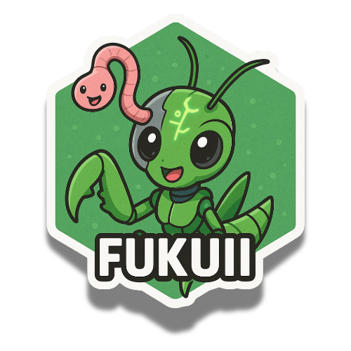

<div align="center">
  
</div>

# Fukuii — Brand Assets

The canonical source for Fukuii's visual identity — logos, favicons, social/OG images, and color
tokens. Every `fukuii-project` repo references these assets from here.

Part of the [Fukuii project](https://github.com/fukuii-project).

## Contents

| Path | What |
|---|---|
| `logo/` | Hex-badge logo (PNG · SVG · traced SVG), wordmarks (light/dark), sized PNGs |
| `favicon/` | Full favicon set + `site.webmanifest` |
| `social/` | Open Graph / social-share images |
| `tokens/` | Color tokens — `colors.css`, `colors.json`, `tailwind.css` |
| `LOGO-STYLE.md` | Logo usage guide + the sampled palette |

## The mark

A sticker-style hex badge: a mantis/grasshopper mascot with a pink worm accessory, bold black
outline, forest-green fills. Playful-technical — memorable, but structured enough to anchor a
technical product. Full usage + palette in [`LOGO-STYLE.md`](LOGO-STYLE.md).

## Palette (sampled from the logo)

| Role | Token | Hex |
|---|---|---|
| Primary green | `--fk-green-3` | `#50a060` |
| Deep green | `--fk-green` | `#1e4a2d` |
| Pink accent (the worm) | `--fk-pink` | `#c06060` |

Full scale in [`tokens/colors.json`](tokens/colors.json) and [`LOGO-STYLE.md`](LOGO-STYLE.md).

## Using the logo in a README

```markdown

```

## License

Assets © 2025–present The Fukuii Authors · Chippr Robotics LLC · White B0x Inc. See [`LICENSE`](LICENSE).
