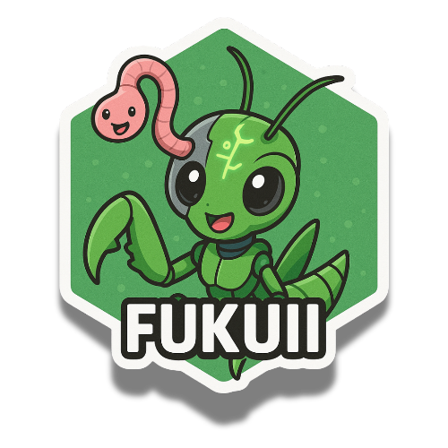
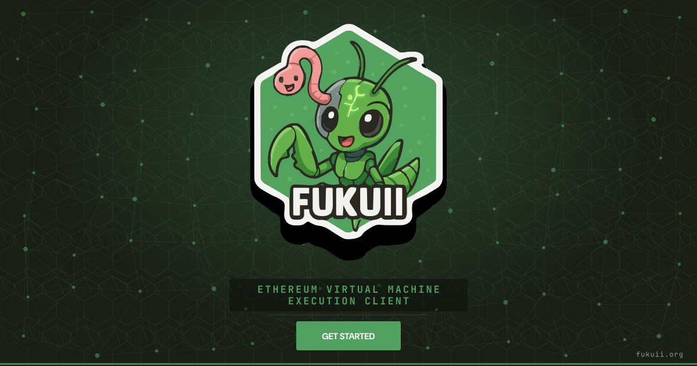

<div align="center">
  

  <h1>Fukuii</h1>

  <strong>Brand and visual identity</strong>

  <p>
    <a href="https://fukuii.org">fukuii.org</a> ·
    <a href="https://github.com/fukuii-project/fukuii-cli">Source</a> ·
    <a href="https://ghcr.io/fukuii-project/fukuii-cli">Containers</a> ·
    <a href="https://github.com/fukuii-project">Project</a>
  </p>
</div>

---

Fukuii is a Scala execution client for Ethereum and the EVM ecosystem. Feature-complete, signed and
SBOM-verifiable, open source, from solo operators to institutional infrastructure. One binary runs
Ethereum Classic, Ethereum mainnet, Mordor and Sepolia from a single deployment.

**This repository is the canonical source of its visual identity.** The site, the container images,
the documentation and every repository in the project draw their marks and colors from here.

<div align="center">
  
</div>

## The mark

A sticker-style badge: bold black outline, flat fills, a white bleed border and a deep drop shadow.
The aesthetic is playful-technical, cute enough to be memorable and structured enough to anchor a
technical product.

At its center sits an anthropomorphic mantis carrying a pink worm, set on a flat-top hexagon, with
the bold slab wordmark **FUKUII** below. It reads at favicon size and holds up on a conference
banner.

Full usage guidance lives in [`LOGO-STYLE.md`](LOGO-STYLE.md).

## Palette

Sampled directly from the logo, so the brand and the artwork can never drift apart.

| Hex | Role | Token |
|---|---|---|
| `#50a060` | Primary green | `--fk-green-3` |
| `#1e4a2d` | Deep green, backgrounds | `--fk-green` |
| `#c06060` | Dusty rose, the worm | `--fk-pink` |

The full scale lives in [`tokens/`](tokens/) as [DTCG](https://www.designtokens.org/tr/2025.10/)
JSON — the source of truth — with CSS custom properties and a Tailwind 4 `@theme` block
generated from it. One definition, every format, no hand-syncing.

## Typography

**DM Sans** for interface and display, **JetBrains Mono** for code, addresses and hashes.

## What lives here

Logos and wordmarks in vector and raster, a complete favicon set, Open Graph and social-share
imagery, and the design tokens that carry the palette, type scale, spacing and motion into any
stack.

| Path | What |
|---|---|
| [`tokens/`](tokens/) | Design tokens. JSON is the source; the CSS and Tailwind files are generated |
| [`reference/`](reference/) | Worked implementations. **Copy from these — they are not a package** |
| `logo/` `favicon/` `social/` `fonts/` | Brand assets |
| [`LOGO-STYLE.md`](LOGO-STYLE.md) | Logo usage guidance |

Fukuii's surfaces — a static site, web apps, a desktop GUI, a CLI — use different
technologies, and two of them cannot read a stylesheet at all. So the tokens are shared and
each surface owns its own implementation. `reference/web/` shows what that looks like in CSS,
including the 13 guideline pages that document the system visually.

Link assets straight from this repo — these paths are stable:

```markdown

```

---

<div align="center">
  <sub>
    Assets © 2025–present The Fukuii Authors · Chippr Robotics LLC · White B0x Inc.<br/>
    Released under the <a href="LICENSE">Apache License 2.0</a>.
  </sub>
</div>
